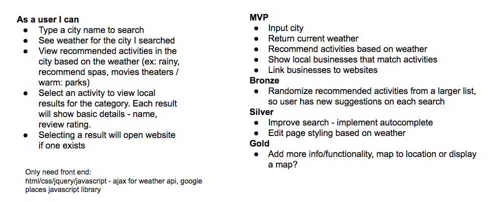
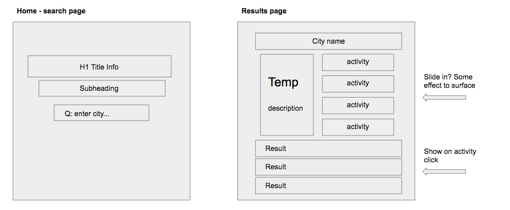

# Weather Planner

**Functionality**

Weather + Local activities all in one app. Search by city, and you'll receive the local weather forecast and a selection of recommended activities based on the local weather.

Ex: A rainy forecast will recommend activities like Movies or Shopping.

Selecting an activity will provide a list of local businesses that match the activity type.

**Technical Information**

App created with Express, Javascript, jQuery, HTML, CSS.

Weather - Uses ajax to get data from [apixu]('https://www.apixu.com/') api.

Local places - Uses [Google Places]('https://developers.google.com/places/') api with javascript library.

To run locally --
You'll need to get api keys from apixu and google.
Insert the google key in the script tag in the views/layout.hbs file
In public/script file, set the secondKey variable to your apixu key.

* `fork and clone this repo`
* `$npm install`
* `$npm start` - will run on your local host at port 3000

**Future Updates**

* Add option to load more place results
* Filter Results. Add my own logic to exclude places that are not a good match for tags - Google's exclude feature does not work.
* Add more categories with more granular weather logic
* Add ability to search for category
* Add logic to adjust search radius based on city type - expand search radius in more rural areas, reduce radius in urban areas.
* More robust weather - hourly forecasts.

**Project Plan**

**Wireframes**

